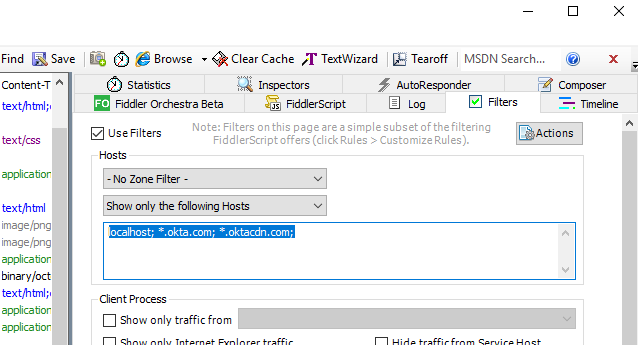
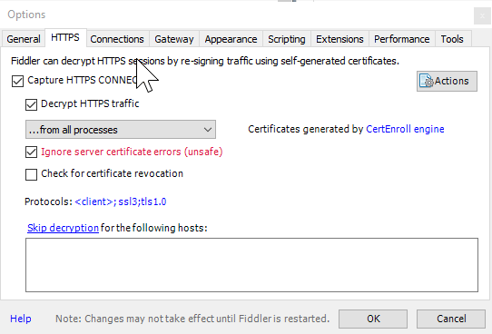
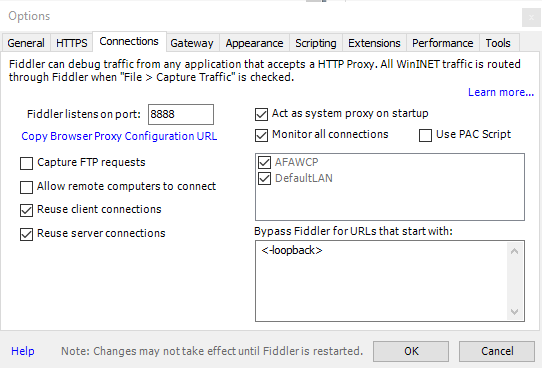
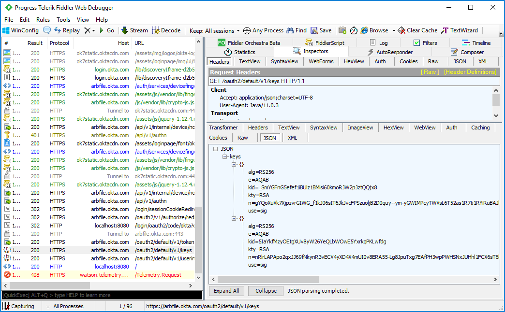

# okta-simple-example
Simple spring boot app demonstrates connecting to Okta service for login.
### Fiddler Instructions

1. [Install Fiddler](https://www.telerik.com/fiddler)
2. Set filters for just localhost and Okta hosts: \

3. Go to Tools | Options menu to open Options Dialog
4. Go to HTTPS tab an click options to capture/decrypt traffic and ignore cert errors: \

5. While still in the Options Dialog, click the Connections tab, verify that Fiddler is listening on port 8888: \

6. Build the FiddlerKeystoreby first exporting the Fiddler cert:  Tools -> Fiddler Options... -> HTTPS -> Export Root Certificate to Desktop \
Next run the following at the commandline (assumes you are in project dir): 
    ```$xslt
    keytool.exe -import -file C:\Users\<Username>\Desktop\FiddlerRoot.cer -keystore .\fiddler\FiddlerKeystore -alias Fiddler
    ```
7. When you run the OktaSimpleExampleApplication class provide the following VM args with -D params: 
    ```$xslt
    -DproxySet=true
    -Dhttp.proxyHost=127.0.0.1
    -Dhttp.proxyPort=8888
    -Dhttps.proxyHost=127.0.0.1
    -Dhttps.proxyPort=8888
    -Djavax.net.ssl.trustStore=.\fiddler\FiddlerKeystore
    -Djavax.net.ssl.trustStorePassword=Fiddler
    ```
8. Back in the main Fiddler window, the filtered network calls will show on left pane.  In the right pane, select the 
Inspectors tab to see the detail of the line items selected on the left pane. \



### Project Build and Run Instructions

The following instructions are specific to building and running this sample with Gradle (gradlew) not using IDE specific plugins and tools.

##### Run Full App on Port 8080

1. Build the Angular part using gradlew :webapp:jar.  This will do an ng build of the Angular application and copy the distribution to webapp/main/resources/public.  The jar task will look here and collect everything under resources into the jar file called webapp.jar.

2. Build the server part using gradlew :server:bootJar.  The webapp.jar will be included into the server.jar as a dependency.  At this point the server code and Angular code are married up into a single jar.

3. The application can be run from the command line using the following:<br>

       java -DproxySet=true -Dhttp.proxyHost=127.0.0.1 
       -Dhttp.proxyPort=8888 -Dhttps.proxyHost=127.0.0.1 
       -Dhttps.proxyPort=8888 
       -Djavax.net.ssl.trustStore=.\fiddler\FiddlerKeystore 
       -Djavax.net.ssl.trustStorePassword=Fiddler 
       -jar server\build\libs\server.jar

**Note that app can also be run with bootRun gradle task.**
